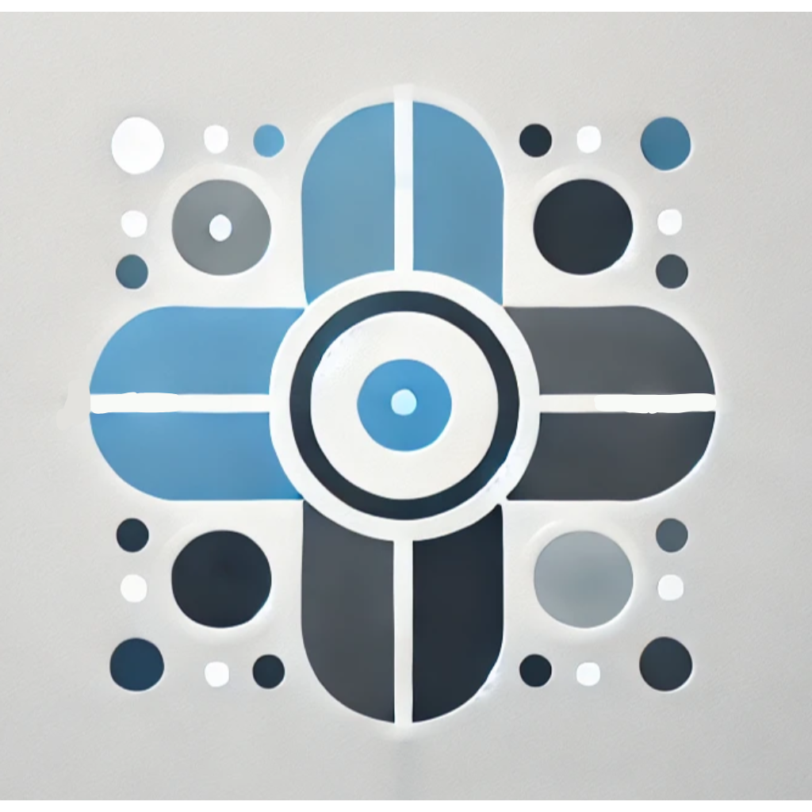

### Our Name
Our robot's name: X-Joyous Partner mainly composes the key letter X, which symbolizes the infinite possibilities of technology and AI. However the next words takes a turn and enforces our idea that technology must not lose emotions and humanity, and eventually must help humanity.
### Our Logo

This logo represents the fusion of healthcare and AI technology through its minimalist and geometric design. The clean lines and circular shapes symbolize precision, balance, and innovation, reflecting the trust and reliability essential in healthcare. The soft blue conveys calmness and professionalism, while the gray adds a touch of technological sophistication. Overall, the abstract design embodies the seamless integration of advanced robotics and AI into the healthcare industry in a modern and approachable way.

The + shaped picture symbolizes the health aspect of the robot and the care it brings, while the eye in the middle symbolizes the AI technology we incorporate with.