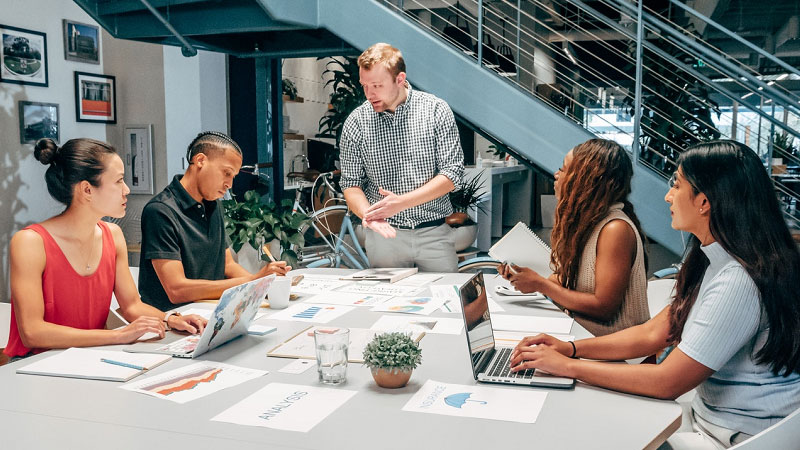

### Our Slogan
##### Let the genius be the man's best companion.
### Our Inspiration
We were extremely motivated by the tragic fates of the isolated elderly. With no friends nor offsprings to stay with them, they not only suffer due to constant medical forgettance but also emotional instability.

### Our Kickstart
The team behind LifeCompanion AI first came together during school, as all four were part of a robotics club. Our shared passion for technology, specifically in the fields of robotics and artificial intelligence, naturally drove us to collaborate on this project that pushed the boundaries of innovation.

### Our Team
Our team is composed of a technical lead, overseeing the development of the AI algorithm; a hardware engineer working on the design of the product; a user experience specialist to ensure the product is intuitive and accessible; and a marketing strategist to position the product and engage early adopters. What drives us to create LifeCompanion AI is rooted in our personal experiences. We had seen the challenges that our loved ones faced in managing their health and the emotional toll of aging. That's why we believe LifeCompanion AI can offer companionship and independence, making aging more dignified and empowered. Our team brings together diverse capabilities: technical expertise, deep knowledge in human-centered design, and passion for the potential of technology to drive social change.

### Our Mission
**To Help, To Support, To Make Remember.**